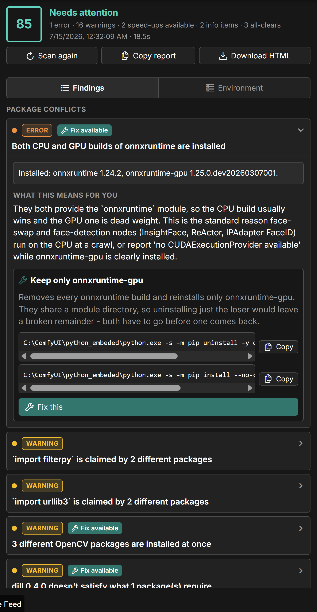
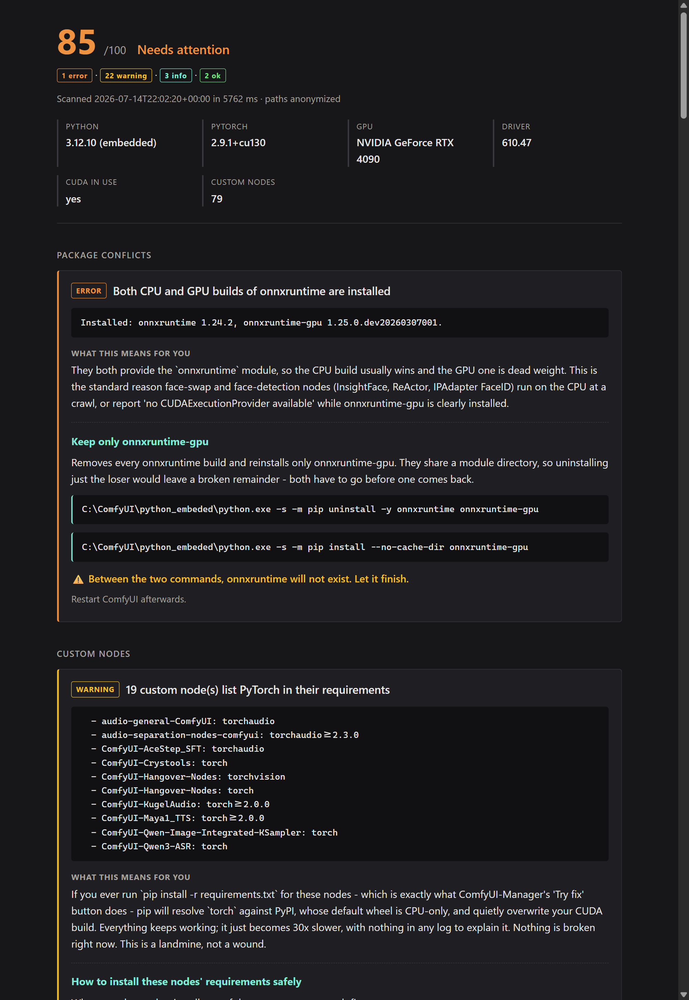

# ComfyDoctor

**Finds what's actually broken in your ComfyUI Python environment — and fixes it.**

Not another "system info" node. ComfyDoctor looks for the specific things that break ComfyUI
in practice — version conflicts, a CPU-only PyTorch quietly replacing your CUDA one, custom
nodes fighting over the same package, `cv2` being claimed by three different installs — and
for each one it tells you *what will actually go wrong for you* and gives you a one-click fix,
built with the correct Python for your install.

> **It also works when ComfyUI won't start.** That's the point. A broken torch means ComfyUI
> never finishes booting, so a diagnostic *node* can never load — it's unavailable at exactly
> the moment you need it. ComfyDoctor ships a standalone launcher for that case.



Every finding says what it is, **what it will actually do to you**, and how to fix it — with a
button that runs the fix against the correct Python for your install.

<details>
<summary><b>The exported report</b> (self-contained HTML, light + dark, paths anonymized)</summary>



</details>

---

## Install

**ComfyUI Manager** — search for **ComfyDoctor**, click Install, restart.

**Manually:**
```
cd ComfyUI/custom_nodes
git clone https://github.com/Kurdknight/Kurdknight_comfycheck
```
Restart ComfyUI. There are no heavy dependencies — it needs only `psutil` and `packaging`,
both of which ComfyUI already installs.

## Use it

### The panel
Open the **Doctor** tab in the ComfyUI sidebar. It scans on open and shows every problem
grouped by severity, with a **Fix this** button where a fix exists. Fixes run in the
background and stream their pip output live into the panel.

### When ComfyUI won't start
This is the case the old version couldn't help with at all.

**Windows:** double-click **`comfydoctor.bat`** in this folder. It finds ComfyUI's real Python
by itself and prints a full diagnosis.

**Any platform:**
```
# ComfyUI portable
python_embeded\python.exe -s ComfyUI\custom_nodes\Kurdknight_comfycheck\doctor.py

# venv / conda / system install
python ComfyUI/custom_nodes/Kurdknight_comfycheck/doctor.py
```

```
python doctor.py                    # diagnose
python doctor.py --quiet            # only the problems
python doctor.py --markdown         # anonymized report, ready to paste into an issue
python doctor.py --html report.html # a self-contained HTML report
python doctor.py --fix <finding-id> # apply one fix
```

Exit code is `0` when clean, `1` on warnings, `2` on errors — so you can gate a launch script
on it.

### As a node
One node, **ComfyDoctor Report** (under `utils/ComfyDoctor`), outputs the report as a `STRING`
plus a `0-100` health score, for anyone who wants it inside a graph.

---

## What it actually checks

**PyTorch**
- CPU-only torch installed on a machine with an NVIDIA GPU — *the silent killer*: nothing
  errors, renders are just 20–50× slower forever. Usually caused by a custom node's
  `requirements.txt` pulling plain `torch` from PyPI over the top of your CUDA build.
- torch / torchvision / torchaudio from different releases (`operator torchvision::nms does
  not exist`)
- Build tags that disagree — a `cu124` torch next to a `cpu` torchvision
- An NVIDIA driver too old for the CUDA build you have installed

**Attention backends**
- xformers / flash-attn / sageattention compiled against a *different torch* than the one
  installed — read straight from package metadata, so we catch it without importing them and
  crashing
- The Linux-only `triton` package installed on Windows (you need `triton-windows`)

**Package conflicts**
- Everything `pip check` would report, but with the reason and the cure in plain English
- `onnxruntime` **and** `onnxruntime-gpu` both installed — the usual reason InsightFace /
  ReActor / IPAdapter FaceID silently run on CPU
- Two or three OpenCV variants fighting over the same `cv2` folder
- numpy 2.x installed alongside packages built for numpy 1.x (`_ARRAY_API not found`)
- The same package installed **twice**, in two different site-packages — so `pip install
  --upgrade` appears to work and ComfyUI keeps loading the old one
- Any two distributions claiming the same import name

**Custom nodes** *(nobody else checks this)*
- Which nodes **failed to import**, cross-referenced with *why* — "IPAdapter_plus failed, and
  it needs insightface, which isn't installed"
- Nodes that loaded fine but whose requirements aren't met — these fail *late*, mid-render
- Nodes whose version pins **genuinely contradict each other**, where no install can satisfy
  both and you have to choose
- Nodes that list `torch` in their `requirements.txt` — a landmine, because installing them
  can silently replace your CUDA PyTorch with the CPU wheel

**System** — Python version vs. what the ecosystem supports, free space on the drive ComfyUI
is *actually on*, RAM, VRAM, and the exact `pip` command for your interpreter.

---

## Design notes

**It never imports a package to inspect it.** Everything comes from `importlib.metadata` — the
`.dist-info` on disk — and from `nvidia-smi`. Importing xformers or flash-attn against a
mismatched torch doesn't raise a tidy `ImportError`; it aborts the process. A diagnostic that
kills the thing it's diagnosing is worthless.

**Fixes are safe by construction.** The browser can never send a command. It sends a *finding
id*, and the server runs only the argv it generated itself during the last scan. Commands are
executed as argv lists with `shell=False` — there is no shell, no quoting, no injection
surface. One repair runs at a time, because two concurrent pips writing the same
site-packages is how a broken environment becomes an unrecoverable one.

**Reports are anonymized.** Your Windows username and home path are stripped, so you can paste
a report into a public GitHub issue without leaking your name.

---

## Upgrading from v1

The old `SystemCheck` and `SystemViz` nodes are **aliased onto the new node**, so existing
workflows still open.

Be aware their output was wrong. The old code called `importlib.import_module("opencv-python")`
to read versions — which can never succeed, because the *module* is named `cv2`. Same for
`scikit-learn`, `pillow` and `face-recognition`. It reported **"Not installed"** for packages
that were installed, and it did it for years. If you were relying on that output, you were
relying on a bug.

## License

MIT — see [LICENSE](LICENSE).
