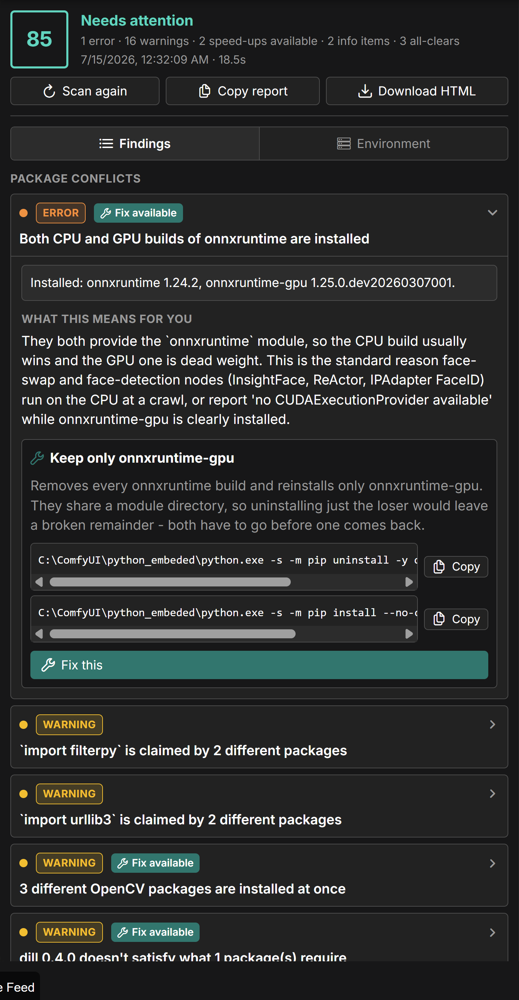
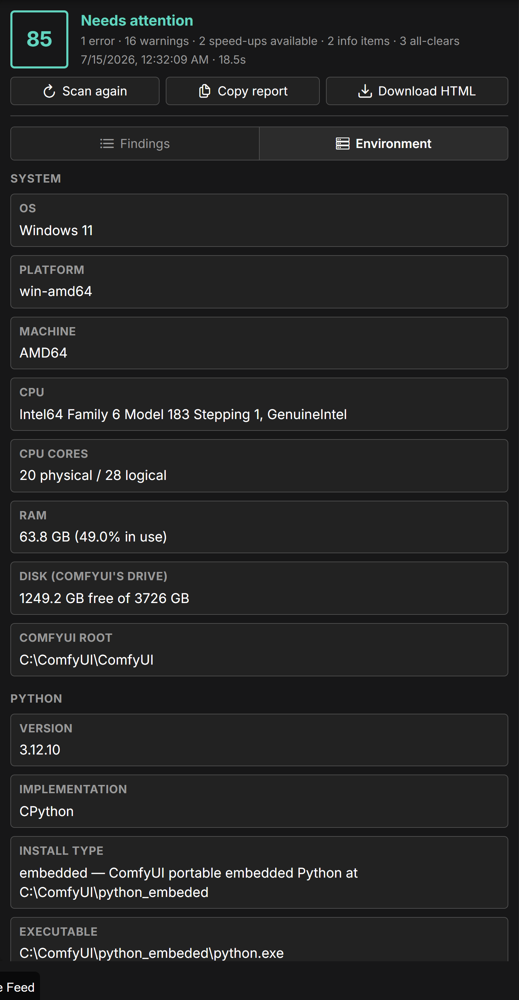
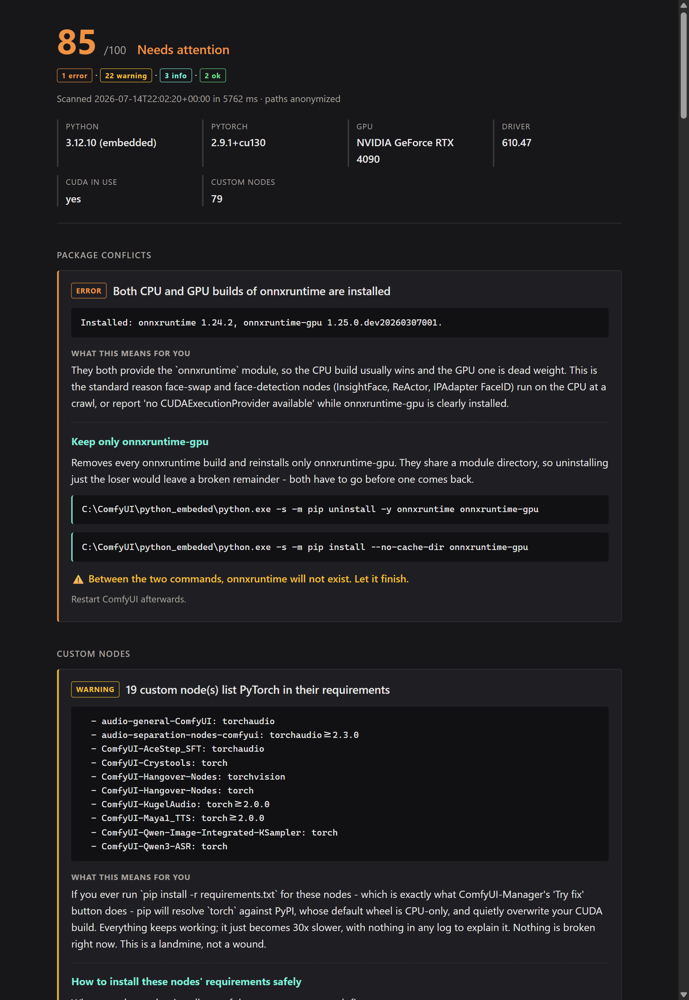

# ComfyDoctor

**Diagnoses what is actually broken in a ComfyUI Python environment — and repairs it in one click.**

ComfyUI runs on a single shared Python environment that dozens of independently written
custom nodes install into. In practice that environment drifts: a CPU-only PyTorch quietly
replaces a CUDA build, two nodes demand incompatible versions of the same package, or three
installs fight over the same `cv2` folder. Nothing errors at startup — things simply run slowly,
or fail deep inside a render.

ComfyDoctor scans for these specific, real-world failures. For each one it explains the concrete
effect on your setup and, where possible, offers a one-click fix that runs against the correct
Python interpreter for your install.

> **It also works when ComfyUI won't start.** A broken PyTorch stops ComfyUI from finishing
> boot, so a diagnostic *node* can never load — it is unavailable at exactly the moment it is
> needed. ComfyDoctor therefore ships a standalone command-line launcher for that case.

<table>
<tr>
<td width="50%"></td>
<td width="50%"></td>
</tr>
<tr>
<td align="center"><b>Findings</b> — what is wrong, what it means for you, and a one-click fix</td>
<td align="center"><b>Environment</b> — your full stack, and what each library is for</td>
</tr>
</table>

Every finding states what it is, what effect it has, and how to resolve it — with a button that
runs the fix against the correct Python for your install. The **Environment** tab provides a full
system-and-library inventory.

<details>
<summary><b>Exported report</b> (self-contained HTML, works in light and dark, paths anonymized)</summary>



</details>

---

## Installation

**Via ComfyUI Manager** — search for **ComfyDoctor**, click Install, then restart ComfyUI.

**Manually:**
```
cd ComfyUI/custom_nodes
git clone https://github.com/Kurdknight/Kurdknight_comfycheck
```
Restart ComfyUI. There are no heavy dependencies — ComfyDoctor needs only `psutil` and
`packaging`, both of which ComfyUI already installs.

---

## Usage

### The sidebar panel

Open the **Doctor** tab in the ComfyUI sidebar. It scans automatically when opened and lists
every issue grouped by severity, with a **Fix this** button wherever an automatic fix exists.
Fixes run in the background, and their pip output streams live into the panel.

### The command line (works even when ComfyUI won't start)

When a broken environment prevents ComfyUI from starting, the panel cannot load. The
command-line launcher runs off the same engine and reports the same findings.

**Windows:** double-click **`comfydoctor.bat`** in this folder. It locates ComfyUI's real Python
interpreter automatically and prints a full diagnosis.

**Any platform:**
```
# ComfyUI portable
python_embeded\python.exe -s ComfyUI\custom_nodes\Kurdknight_comfycheck\doctor.py

# venv / conda / system install
python ComfyUI/custom_nodes/Kurdknight_comfycheck/doctor.py
```

Common options:
```
python doctor.py                    # full diagnosis
python doctor.py --quiet            # only the problems
python doctor.py --env              # full environment inventory
python doctor.py --markdown         # anonymized report, ready to paste into an issue
python doctor.py --html report.html # a self-contained HTML report
python doctor.py --fix <finding-id> # apply one fix (id shown in brackets)
```

The exit code is `0` when clean, `1` on warnings, and `2` on errors — so a launch script can be
gated on it.

### The node

A single node, **ComfyDoctor Report** (category `utils/ComfyDoctor`), outputs the report as a
`STRING` alongside a `0–100` health score, for use inside a graph — for example piping the report
into a text overlay or saving it beside a batch render. The interactive panel remains the primary
way to view and fix issues.

---

## What it checks

**PyTorch**
- CPU-only PyTorch installed on a machine with an NVIDIA GPU. Nothing errors; renders are simply
  20–50× slower, indefinitely. Usually caused by a custom node's `requirements.txt` pulling plain
  `torch` from PyPI over an existing CUDA build.
- `torch` / `torchvision` / `torchaudio` from mismatched releases (which surface as errors such as
  `operator torchvision::nms does not exist`).
- Build tags that disagree — for example a `cu124` torch beside a `cpu` torchvision.
- An NVIDIA driver too old for the installed CUDA build.

**Attention backends**
- xformers / flash-attn / sageattention compiled against a *different* PyTorch than the one
  installed. This is read from package metadata, so the mismatch is caught without importing the
  package (which would otherwise abort the process).
- The Linux-only `triton` package installed on Windows, where `triton-windows` is required.

**Package conflicts**
- Everything `pip check` would report, restated with the cause and the fix in plain language.
- `onnxruntime` and `onnxruntime-gpu` both installed — a common reason InsightFace / ReActor /
  IPAdapter FaceID silently fall back to CPU.
- Multiple OpenCV variants competing for the same `cv2` folder.
- numpy 2.x installed alongside packages built for numpy 1.x (`_ARRAY_API not found`).
- The same package installed twice in different site-packages directories, so `pip install
  --upgrade` appears to work while ComfyUI keeps loading the old copy.
- Any two distributions claiming the same import name.

**Custom nodes**
- Which nodes failed to import, cross-referenced with *why* — for example "IPAdapter_plus failed,
  and it requires insightface, which is not installed."
- Nodes that loaded but whose requirements are unmet, which typically fail later, mid-render.
- Nodes whose version pins genuinely contradict one another, where no single install can satisfy
  both and a choice has to be made.
- Nodes that list `torch` in their `requirements.txt` — a risk, because installing them can
  silently replace a CUDA PyTorch with the CPU wheel.

**System** — Python version against what the ecosystem supports, free space on the drive ComfyUI
is actually installed on, system RAM, VRAM, and the exact `pip` command for your interpreter.

---

## How it works

**Findings come from package metadata, not from importing packages.** Version and build
information is read from the `.dist-info` records on disk (`importlib.metadata`) and from
`nvidia-smi`. ABI-bound packages such as xformers and flash-attn are never imported, because
importing one built against a mismatched PyTorch does not raise a clean `ImportError` — it aborts
the process. PyTorch itself is the one package that must be probed directly; when it is not
already loaded, that probe runs in an isolated subprocess, so a crashing CUDA/driver pairing is
reported rather than fatal.

**Fixes are safe by construction.** The browser never sends a command. It sends a *finding id*,
and the server runs only the argument list it generated itself during the last scan. Commands are
executed as argv lists with `shell=False` — no shell, no quoting, no injection surface. Only one
repair runs at a time, because two concurrent pip processes writing the same site-packages is how
a recoverable environment becomes an unrecoverable one.

**Reports are anonymized.** Your username and home path are stripped from exported reports, so a
report can be pasted into a public GitHub issue or a Discord help channel without leaking personal
details.

---

## Compatibility with earlier versions

The previous `SystemCheck` and `SystemViz` nodes are aliased onto the new **ComfyDoctor Report**
node, so workflows saved with an older version continue to open without changes.

## License

MIT — see [LICENSE](LICENSE).
